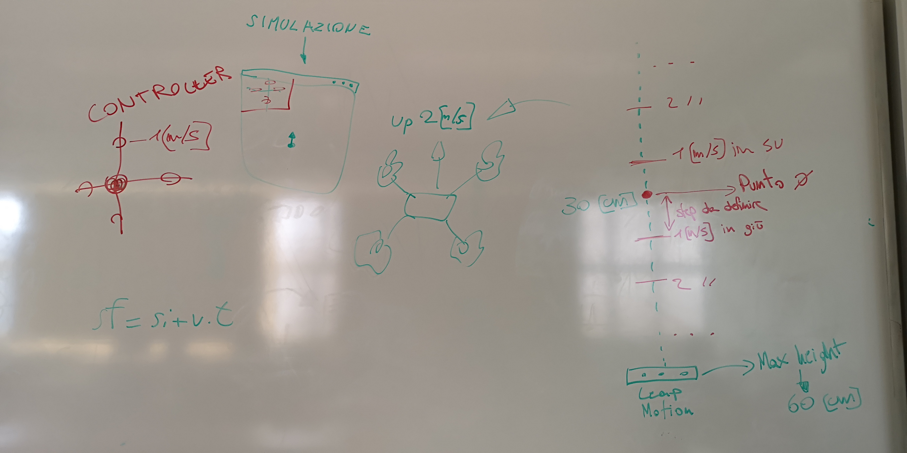

# PROGETTO Drone Control System | Diario di lavoro - 20.02.2019
##### Luca Di Bello, Fadil Smajilbasic, Andrea Rauso, Jari Näser
### Canobbio, 20.02.2019

## Lavori svolti
Durante la giornata odierna il gruppo ha deciso come verranno letti i dati dal sensore Leap Motion e come verranno visualizzati.

Il sensore leggerà l'altezza e/o l'inclinazione della mano che indicherà la velocità di spostamento su un determinato asse(nell'immagine sottostante a destra), la conversione di questi valori in velocità dovrà ancora essere deciso. La velocità verra mostrata in un frame su un diagramma a tre assi(nell'immagine sottostante a sinistra).

Qui di seguito una rappresentazione:

Fadil ha creato la classe LeapMotionReader che permette di leggere i dati dal sensore Leap Motion quali la posizione e la rotazione (beccheggio, rollio e imbardata) sui 3 assi di movimento della mano.

Luca e Jari si sono dedicati alla gestione delle classi per l'invio e della ricezione dei comandi

Andrea ha continuato l'analisi della libreria per creare i grafici per il drone

##  Problemi riscontrati e soluzioni adottate
Nella gestione dei pacchetti il controller riesce a inviare e ricevere correttamente i pacchetti UDP mentre il simulatore riesce a ricevere ma non a inviare i pacchetti verso il controller

##  Punto della situazione rispetto alla pianificazione
In orario
