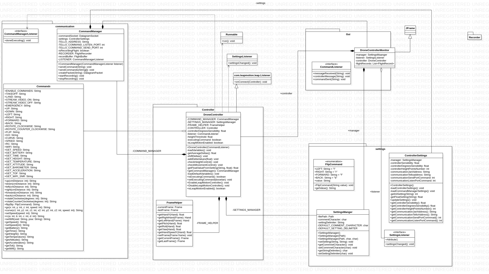
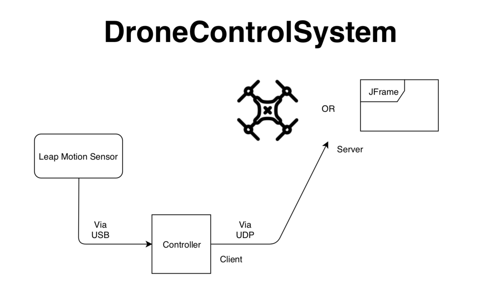
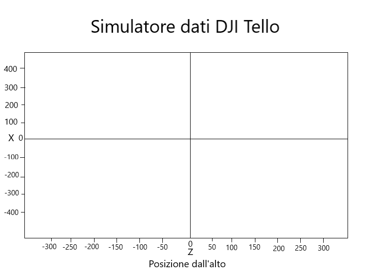
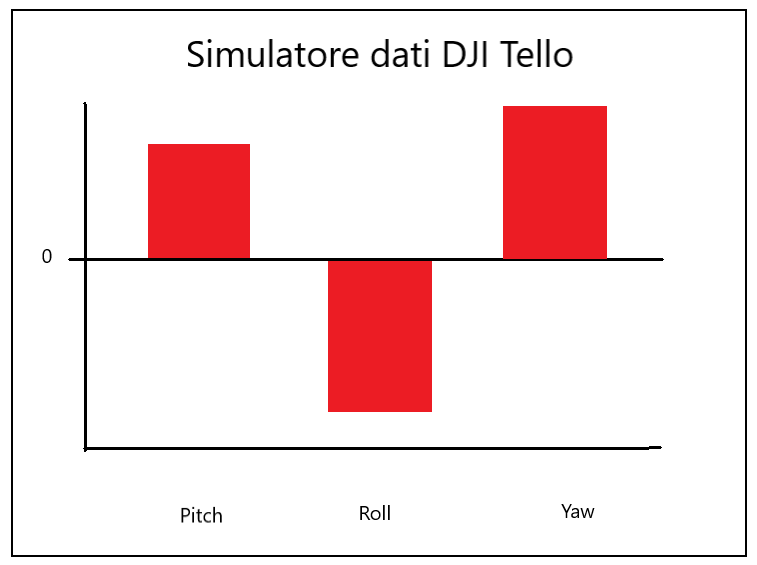
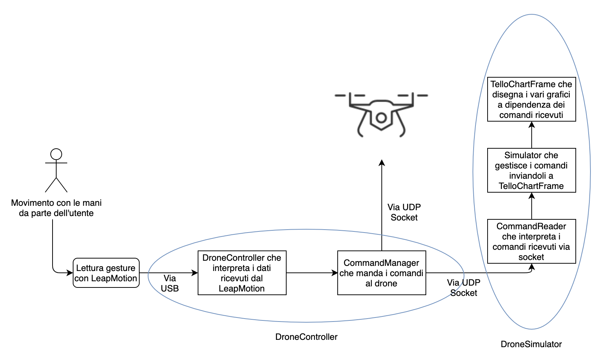
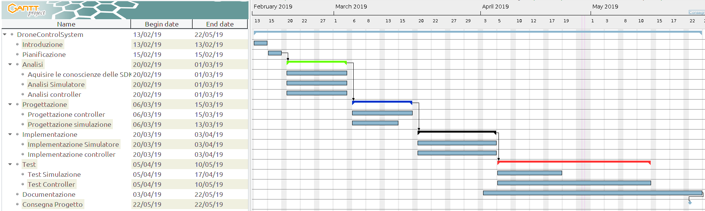

# Drone Control System

#### Da Fare:
- 1.5: Aggiungere eventuali requisiti
- 3.1: Fare tutta la parte di implementazione Luca e Fadil
- 4.1: Fare test-case
- 6.2: Da completare
- Sommario: aggiornarlo

---

1. [Introduzione](#1.-introduzione)

    1.1 [Informazioni sul progetto](#1.1-informazioni-sul-progetto)

    1.2 [Abstract](#1.2-abstract)

    1.3[Scopo](#1.3-scopo)

  - [Analisi](#analisi)

    1.4 [Analisi del dominio](#1.4-analisi-del-dominio)

    1.5 [Analisi dei mezzi](#1.5-analisi-dei-mezzi)

    1.6 [Analisi e specifica dei requisiti](#1.6-analisi-e-specifica-dei-requisiti)

    1.7 [Pianificazione](#1.7-pianificazione)

2. [Progettazione](#2.-progettazione)

    2.1 [Design dell’architettura del sistema](#2.1-design-dell’architettura-del-sistema)

    2.2 [Schema logico](#2.2-schema-logico)

    2.3 [Design delle interfacce](#2.3-design-delle-interfacce)

    2.4 [Design procedurale](#2.4-design-procedurale)

3. [Implementazione](#3.-implementazione)

    3.1 [Drone Controller](#3.1-drone-controller)

    3.2 [Drone Simulator](#3.2-drone-simulator)

4. [Test](#4.-test)

    4.1 [Protocollo di test](#4.1-protocollo-di-test)

    4.2 [Risultati test](#4.2-risultati-test)

    4.3 [Mancanze/limitazioni conosciute](#4.3-mancanze/limitazioni-conosciute)

5. [Consuntivo](#5.-consuntivo)

6. [Conclusioni](#6.-conclusioni)

    6.1 [Sviluppi futuri](#6.1-sviluppi-futuri)

    6.2 [Considerazioni personali](#6.2-considerazioni-personali)

7. [Bibliografia](#7.-bibliografia)

    7.1 [Sitografia](#7.1-sitografia)

8. [Allegati](#8.-allegati)

## 1. Introduzione
---

### 1.1 Informazioni sul progetto

  Il progetto è gestito e realizzato dagli allievi Luca Di Bello, Fadil Smajlbasic, Jari Näser, Andrea Rauso (studenti di informatica all’Arti e Mestieri di Trevano) sotto la supervisione del professor Luca Muggiasca. Abbiamo a disposizione un dispositivo chiamato "Leap Motion", il quale permette il tracking di precisione delle mani e dei loro movimenti e il drone DJI Tello sul quale effettueremo tutti i test della nostra libreria.
  La realizzazione del progetto inizia il 13 febbraio 2019 (13/02/19) e dovrà essere consegnato entro il 22 maggio 2019 (22/05/19).

### 1.2 Abstract

  Nowadays drones are really popular in various areas such as personal use and professional environment.
  To make these awesome quadcopters accessible to all ages in a really fun way as a team we decided to create a program that reads data from a sensor (LeapMotion©) that tracks the user's hands, transforms the movement in commands and sends them to the drone.
  With our product it's really easy to fly a drone with your own hands.

### 1.3 Scopo

  Lo scopo di questo progetto è di creare un sistema che permette di controllare il drone *DJI Tello* tramite un dispositivo chiamato [Leap Motion](https://www.leapmotion.com "Leap Motion official website") (un sensore che permette il tracking dei movimenti delle mani in modo preciso). Non disponendo di un drone *DJI Tello* verrà simulato il funzionamento tramite un'altra applicazione la quale mostrerà in 4 riquadri le quali rappresenteranno in 2d le seguenti informazioni: imbardata, beccheggio, rollio ed altitudine.
  Entrambe le applicazioni devono essere scritte nel linguaggio Java ed il drone deve venir controllato utilizzando entrambe le mani. Una mano si occupa dell'altitudine ed altre funzioni utili alla guida mentre l'altra si occupa dei movimenti del drone, ovvero imbardata, beccheggio e rollio.

## Analisi

### 1.4 Analisi del dominio

  Questo genere di prodotto orientato verso entusiasti di aviazione ed informatica
  attualmente esiste solamente progettato e scritto privatamente in vari linguaggi come
  Ruby, Python e PHP ma non ancora in Java.

### 1.5 Analisi e specifica dei requisiti

  Il committente necessita di un sistema che comprende un simulatore di volo e di un controller. Il simulatore di volo simulerà il funzionamento
  del drone *DJI Tello* mentre il controller si occuperà di controllare il drone all'interno della simulazione utilizzando il controller *Leap Motion*. Il drone verrà controllato con entrambe le mani: Una mano si occuperà di controllare l'altitudine del drone mentre l'altra mano si occuperà dei movimenti del drone, quindi imbardata, rollio e beccheggio.
  I comandi inviati dal controller verso il drone simulato verranno inviati rispettando il protocollo di comunicazione ufficiale fornito da *ryzerobotics.com*.

  |ID  |REQ-001                                         |
  |----|------------------------------------------------|
  |**Nome**    |Controller in Java|
  |**Priorità**|1                     |
  |**Versione**|1.0                   |
  |            |**Sotto requisiti**|
  |**001**      | Controllo del drone tramite Leap Motion |
  |**002**      | Visualizzazione in streaming video riportato dal drone |
  |**003**      | Possibilità di registrazione del volo in modo da poterlo ripetere |
  |**004**      | Deve ottenere tutte le informazioni del drone per poi renderle disponibili in una pagina web sotto forma di statistica |
  |**005**      | Codice ben commentato (Inglese o Italiano)|

  |ID  |REQ-002                                         |
  |----|------------------------------------------------|
  |**Nome**    |Simulazione DJI Tello in Java|
  |**Priorità**|1                     |
  |**Versione**|1.0                   |
  |            |**Sotto requisiti**|
  |**001**      | Visualizzazione in 2d dell'imbardata, beccheggio, rollio ed altitudine del drone |
  |**002**      | Codice ben commentato (Inglese o Italiano)|

  |ID  |REQ-003                                         |
  |----|------------------------------------------------|
  |**Nome**    |File di config per controller|
  |**Priorità**|2                     |
  |**Versione**|1.0                   |
  |            |**Sotto requisiti**|
  |**001**      | Modificabile tramite GUI in modo semplice e veloce |
  |**002**      | Le impostazioni devono venir caricate automaticamente all'avvio del programma |
  |**002**      | Possibilità di manipolare le impostazioni salvate all'interno del file anche tramite codice |
  |**002**      | Codice ben commentato (Inglese o Italiano)|

### 1.6 Pianificazione

Questa è la pianificazione e struttura che abbiamo cercato di rispettare per
tutto il percorso di questo progetto.


### 1.7 Analisi dei mezzi

### 1.7.1 Software

Per la realizzazione di questo progetto abbiamo usato come software:

- GitHub 2.20.1: Punto di riferimento per tutto il team sul quale si carica continuamente il lavoro fatto attraverso commit in un sistema di versioning.

- GitHub Desktop 1.6.5: Programma per effettuare il push e pull di commit attraverso un'interfaccia grafica.

- Atom 1.36.1: Editore di testo per scrivere principalmente la documentazione e
risolvere conflitti.

- NetBeans 8.2:  IDE per sviluppare tutto il codice scritto in Java.

- VisualStudio Code 1.33.1: Editore di testo usato in tutti i contesti.

- SDK LeapMotion 2.3.1: Libreria che permette alle classi di Java di leggere i vari movimenti delle mani dal sensore LeapMotion.

- GanttProject 2.8.9: Software per creare una progettazione delle tempistiche per il progetto.

### 1.7.2 Hardware

Per poter realizzare questo progetto abbiamo usato il seguente materiale:

- Sensore LeapMotion.

- Drone DJI Tello.

- Apple MacBook Pro 2015 con OSX Mojave.

- Asus VivoBook 2015 con Windows 10.

- Asus ROG GL702VM con Windows 10.

- HP Pavilion CS-0800 con Linux Ubuntu 19.04.

## 2 Progettazione

---

### 2.1 Design dell’architettura del sistema

Nell'immagine sottostante viene rappresentata la struttura delle classi del Controller del drone


Nell'immagine sottostante viene rappresentata la struttura delle classi del Simulatore del drone



### 2.2 Schema logico

Nell'immagine sottostante viene rappresentato lo schema logico di questo progetto.<br>
Sul lato sinistro si può vedere il sensore ed il controller che fanno da client, successivamente i dati rilevati verranno mandati attraverso un socket UDP in Java al Simulatore oppure al Drone stesso.



### 2.3 Design delle interfacce

#### 2.3.1 Simulatore

##### Interfaccia della posizione del drone

Per la visualizzazione della posizione del drone nel simulatore é stato scelto un diagramma cartesiano in cui verra mostrato lo spostamento del drone su 2 assi.
Sono state create 2 interfacce, una con la visuale dall'alto (Assi X e Z) e una con visuale di profilo (Assi X e Y)



##### Interfaccia della rotazione del drone

Per la visualizzazione della rotazione del drone sui tre assi nel simulatore é stato scelto un diagramma a barre sulla quale mostrare i dati di beccheggio, imbardata e rollio.



#### 2.3.2 Controller

##### Interfaccia del controller del drone

Per la GUI del controller abbiamo pensato ad una finestra con più tab dove ogni sezione ha uno scopo specifico.
Le sezioni che abbiamo pensato sono queste:

- Log
  - Textarea che permette di leggere direttamente dalla GUI i log

- Comandi rapidi
  - Serie di pulsanti che permettono di guidare il drone a distanza senza utilizzare il controller Leap Motion
- Recording
  - Pulsanti che permettono di iniziare/finire una registrazione ed un selettore che permette di selezionare il file di registrazione per poi eseguirlo
- Settings
  - Una tabella che mostra il nome dei ogni opzione presente nel file di config ed delle textbox affianco ad ogni label che permettono di leggere/scrivere l'impostazione salvata su file

# INSERIRE IMMAGINE SCHIZZO (GIMP)

### 2.4 Design procedurale

Diagramma di flusso del progetto, a dipendenza della modalità che si sceglierà i dati vengono inviati via socket UDP al drone DJI Tello oppure a DroneSimulator.



## 3 Implementazione

---

### 3.1 Drone Controller

### 3.2 Drone Simulator

#### 3.2.1 TelloChartFrame

Questa classe ha lo scopo di mostrare all'interno di un JFrame le informazioni sulla posizione del drone sui 3 assi con una vista di profilo e una vista dall'alto e la rotazione del drone sui 3 assi di rotazione (beccheggio, imbardata e rollio).
La rappresentazione delle informazioni avvengono tramite grafici cartesiani per la posizione e tramite grafico a barre per la rotazione, i grafici sono stati costruiti grazie alla libreria gratuita JFreeChart.

#### 3.2.2 Simulator

La classe Simulator permette di ricevere tutte le richiese e i comandi in entrata sulla porta del socket ```8889```.
La classe filtra, legge e controlla i comandi in entrata in modo da poter inoltrare il contenuto verso la classe CommandReader.

#### 3.2.3 CommandReader

La classe CommmandReader riceve il metodo richiesto via socket per poi chiamare il rispettivo metodo per simulare nel miglior modo possibile il comportamento del drone modificando le tre variabili che rappresentano le tre assi X, Y e Z.

#### 3.2.4 BatteryThread

La classe BatteryThread monitora e gestisce la durata del volo del drone e la sua batteria.
Quando la batteria del drone equivale allo 0%, questo comincierà automaticamente ad atterare attraverso il metodo emergency() della classe CommandReader.

```java
public class BatteryThread extends Thread{

    /**
     * CommandReader class that manages the drone's movements.
     */
    private CommandReader cr;

    /**
     * Boolean that specifies if the drone should keep flying.
     */
    private boolean keepFlying;

    public BatteryThread(CommandReader cr){
        this.cr = cr;
        keepFlying = true;
    }

    @Override
    public void run(){
        while(keepFlying){
            try{
                if(cr.getBattery() == 0){
                    cr.emergency();
                    keepFlying = false;
                }else{
                    Thread.sleep(1000);
                }
            }catch(InterruptedException ie){
                System.out.println("BatteryThread has been interrupted.");
            }
        }
    }  
}
```

#### 3.2.5 PacketReceivingCheckerThread

La classe PacketReceivingCkerThread controlla la frequenza di ricezione dei comandi della classe Simulator.
Se per 15 secondi non viene ricevuto un qualsiasi pacchetto il drone comincierà automaticamente ad atterrare attraverso il metodo emergency() della classe CommandReader come descritto dalla SDK.

```java
public class PacketReceivingCheckerThread extends Thread{

    /**
     * Time to wait before calling CommandReader's emergency() method.
     */
    private final int SECONDS_TO_WAIT = 15;
    /**
     * CommandReader that contains all the methods to control the drone.
     */
    private CommandReader cr;

    public PacketReceivingCheckerThread(CommandReader cr){
        this.cr = cr;
    }

    @Override
    public void run(){
        try{
            long startTime = System.currentTimeMillis();
            while((System.currentTimeMillis() - startTime)/1000 < SECONDS_TO_WAIT){
                Thread.sleep(500);
            }
            cr.emergency();
        }catch(InterruptedException ie){
            System.err.println("PacketReceivingCheckerThread has been interrupted.");
        }
    }  
}
```

## 4 Test

---

### 4.1 Protocollo di test

|Test Case      | TC-001                               |
|---------------|--------------------------------------|
|**Nome**       |Import a card, but not shown with the GUI |
|**Riferimento**|REQ-012                               |
|**Descrizione**|Import a card with KIC, KID and KIK keys with no obfuscation, but not shown with the GUI |
|**Prerequisiti**|Store on local PC: Profile\_1.2.001.xml (appendix n\_n) and Cards\_1.2.001.txt (appendix n\_n) |
|**Procedura**     | - Go to “Cards manager” menu, in main page click “Import Profiles” link, Select the “1.2.001.xml” file, Import the Profile - Go to “Cards manager” menu, in main page click “Import Cards” link, Select the “1.2.001.txt” file, Delete the cards, Select the “1.2.001.txt” file, Import the cards |
|**Risultati attesi** |Keys visible in the DB (OtaCardKey) but not visible in the GUI (Card details) |

### 4.2 Risultati test

|Test      | Risultato test                               |
|---------------|--------------------------------------|
|TC-001      | Passato ✔                            |
|TC-003      | Non passato ❌                               |
|ECCETERA      | ECCETERA                               |


### 4.3 Mancanze/limitazioni conosciute

Il nostro prodotto ha delle limitazioni soltanto dalla parte del controller.
Esso infatti non permette ricevere i dati dello stream video del drone e quindi non permette all'utente di visionare ciò che vede Tello con la sua telecamera.
La seconda mancanza è la pagina web con le statistiche relative allo stato del drone.

## 5 Consuntivo

---

Rispetto al diagramma iniziale abbiamo in parte unito le due fasi di progettazione ed
implementazione visto che era un lavoro spesso asincrono per ogni membro del team, di conseguenza non conoscendo ancora la natura di svariati componenti utilizzati per realizzare questo prodotto abbiamo optato per questa soluzione potendo così informarci e lavorare sul progetto contemporaneamente.
Per il resto abbiamo allungato un po' la fase dei test dovendo raffinare ed osservare i movimenti del drone e l'invio dei vari comandi via socket.


## 6 Conclusioni

---
Il nostro prodotto permette un uso molto semplice e anche abbastanza accessibile a chiunque sia appassionato oppure anche nuovo nel mondo dei droni.
Il nostro prodotto offre un modo semplice ad accessibile a chiunque voglia 
Usando le proprie mani è possibile guidare il drone per l'aria avendo la possibilità di farli fare svariati movimenti come quelli normali di movimento oppure quelli acrobatici come un looping.

### 6.1 Sviluppi futuri

Uno sviluppo futuro molto utile sarebbe sicuramente la possibilità di mostrare lo stream video del drone direttamente sulla GUI del controller. Questo infatti permetterebbe di pilotare il drone a distanza senza doverlo per forza vedere con i propri occhi.

### 6.2 Considerazioni personali

### 6.3 Luca

Questo progetto mi ha aiutato molto a capire il funzionamento della comunicazione tramite socket tra due dispositivi di rete. Grazie a queste nuove conoscenze apprese ho potuto continuare a programmare dei miei progetti privati che avevo lasciato in sospeso (Reverse TCP Shell, invio di file da remoto,...)

### 6.4 Fadil

# DA COMPLETARE

### 6.4 Jari
# DA COMPLETARE

### 6.4 Rausone
# DA COMPLETARE

## 7 Bibliografia

---

### 7.1 Sitografia

- <http://standards.ieee.org/guides/style/section7.html>, *IEEE Standards Style Manual*, 13.02.2019 - 10.05.2019.

- <http://www.jfree.org/jfreechart/>, *JFreeChart*, 13.02.2019 - 10.05.2019

- <https://github.com/jfree/jfreechart>, *A 2D chart library for Java applications (JavaFX, Swing or server-side)*, 13.02.2019 - 10.05.2019

- <http://www.jfree.org/jfreechart/api/javadoc/overview-summary.html>, *JFreeChart 1.5.0 API*, 13.02.2019 - 10.05.2019

- <https://stackoverflow.com/>, *StackOverflow*, 13.02.2019 - 10.05.2019

- <https://www.leapmotion.com/>, *Leap Motion*, 13.02.2019 - 10.05.2019.

- <https://www.ryzerobotics.com/tello>, *Tello SDK*, 13.02.2019 - 10.05.2019

- <https://www.draw.io/>, *Draw io*, 15.05.2019

## 8 Allegati

---

- Diari di lavoro

- Codici sorgente

- Gantt preventivo e Gantt consuntivo

- Documentazione protocollo di comunicazione per DJI Tello

- Qdc

- Prodotto
