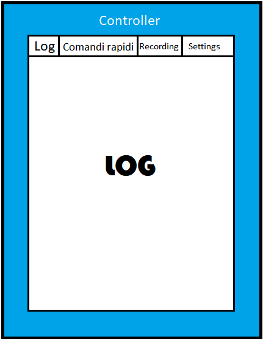
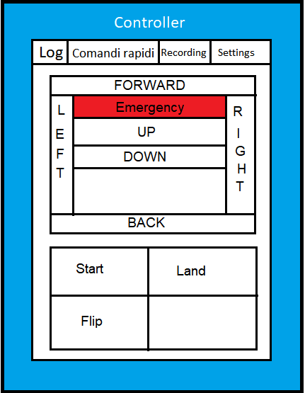
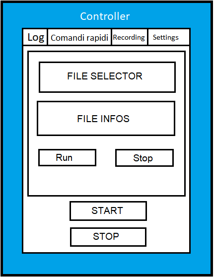
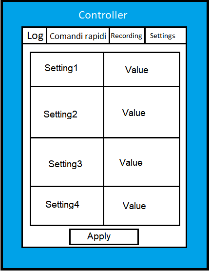

# Drone Control System

#### Da Fare:
- 4.1: Fare test-case
- 6.2: Da completare
- Sommario: aggiornarlo

---

* [1. Introduzione](#1-introduzione)

+ [1.1 Informazioni sul progetto](#11-informazioni-sul-progetto)
+ [1.2 Abstract](#12-abstract)
+ [1.3 Scopo](#13-scopo)

* [Analisi](#analisi)

+ [1.4 Analisi del dominio](#14-analisi-del-dominio)
+ [1.5 Analisi e specifica dei requisiti](#15-analisi-e-specifica-dei-requisiti)
+ [1.6 Pianificazione](#16-pianificazione)
+ [1.7 Analisi dei mezzi](#17-analisi-dei-mezzi)
+ [1.7.1 Software](#171-software)
+ [1.7.2 Hardware](#172-hardware)

* [2 Progettazione](#2-progettazione)
+ [2.1 Design dell’architettura del sistema](#21-design-dell-architettura-del-sistema)
+ [2.2 Schema logico](#22-schema-logico)
+ [2.3 Design delle interfacce](#23-design-delle-interfacce)
    - [2.3.1 Simulatore](#231-simulatore)
    * [Interfaccia della posizione del drone](#interfaccia-della-posizione-del-drone)
    * [Interfaccia della rotazione del drone](#interfaccia-della-rotazione-del-drone)
    - [2.3.2 Controller](#232-controller)
    * [Log](#log)
    * [Comandi rapidi](#comandi-rapidi)
    * [Recording](#recording)
    * [Settings](#settings)
+ [2.4 Design procedurale](#24-design-procedurale)

* [3 Implementazione](#3-implementazione)
+ [3.1 Drone Controller](#31-drone-controller)
+ [3.1.1 DroneController](#311-dronecontroller)
    * [CheckHeightControl](#checkheightcontrol)
    * [checkMovementControl](#checkmovementcontrol)
    * [getRoll](#getroll)
+ [3.2 Drone Simulator](#32-drone-simulator)
    - [3.2.1 TelloChartFrame](#321-tellochartframe)
    - [3.2.2 Simulator](#322-simulator)
    - [3.2.3 CommandReader](#323-commandreader)
    - [3.2.4 BatteryThread](#324-batterythread)
    - [3.2.5 PacketReceivingCheckerThread](#325-packetreceivingcheckerthread)

* [4 Test](#4-test)
+ [4.1 Protocollo di test](#41-protocollo-di-test)
+ [4.2 Risultati test](#42-risultati-test)
+ [4.3 Mancanze/limitazioni conosciute](#43-mancanze-limitazioni-conosciute)

* [5 Consuntivo](#5-consuntivo)

* [6 Conclusioni](#6-conclusioni)
+ [6.1 Sviluppi futuri](#61-sviluppi-futuri)
+ [6.2 Considerazioni personali](#62-considerazioni-personali)
+ [6.2.1 Luca](#621-luca)
+ [6.2.2 Fadil](#622-fadil)
+ [6.2.3 Jari](#623-jari)
- [DA COMPLETARE](#da-completare)
+ [6.2.4 Rausone](#624-rausone)
- [DA COMPLETARE](#da-completare-1)

* [7 Bibliografia](#7-bibliografia)
+ [7.1 Sitografia](#71-sitografia)
* [8 Allegati](#8-allegati)

## 1. Introduzione
---

### 1.1 Informazioni sul progetto

  Il progetto è gestito e realizzato dagli allievi Luca Di Bello, Fadil Smajlbasic, Jari Näser, Andrea Rauso (studenti di informatica all’Arti e Mestieri di Trevano) sotto la supervisione del professor Luca Muggiasca. Abbiamo a disposizione un dispositivo chiamato "Leap Motion", il quale permette il tracking di precisione delle mani e dei loro movimenti e il drone DJI Tello sul quale effettueremo tutti i test della nostra libreria.
  La realizzazione del progetto inizia il 13 febbraio 2019 (13/02/19) e dovrà essere consegnato entro il 22 maggio 2019 (22/05/19).

### 1.2 Abstract

  Nowadays drones are really popular in various areas such as personal use and professional environment.
  To make these awesome quadcopters accessible to all ages in a really fun way as a team we decided to create a program that reads data from a sensor (LeapMotion©) that tracks the user's hands, transforms the movement in commands and sends them to the drone.
  With our product it's really easy to fly a drone with your own hands.

### 1.3 Scopo

  Lo scopo di questo progetto è di creare un sistema che permette di controllare il drone *DJI Tello* tramite un dispositivo chiamato [Leap Motion](https://www.leapmotion.com "Leap Motion official website") (un sensore che permette il tracking dei movimenti delle mani in modo preciso). Non disponendo di un drone *DJI Tello* verrà simulato il funzionamento tramite un'altra applicazione la quale mostrerà in 4 riquadri le quali rappresenteranno in 2d le seguenti informazioni: imbardata, beccheggio, rollio ed altitudine.
  Entrambe le applicazioni devono essere scritte nel linguaggio Java ed il drone deve venir controllato utilizzando entrambe le mani. Una mano si occupa dell'altitudine ed altre funzioni utili alla guida mentre l'altra si occupa dei movimenti del drone, ovvero imbardata, beccheggio e rollio.

## Analisi

### 1.4 Analisi del dominio

  Questo genere di prodotto orientato verso entusiasti di aviazione ed informatica attualmente è stato solamente sviluppato e progettato in vari linguaggi come Ruby, Python e PHP ma non ancora in Java.

### 1.5 Analisi e specifica dei requisiti

  Il committente necessita di un sistema che comprende un simulatore di volo e di un controller. Il simulatore di volo simulerà il funzionamento
  del drone *DJI Tello* mentre il controller si occuperà di controllare il drone all'interno della simulazione utilizzando il controller *Leap Motion*. Il drone verrà controllato con entrambe le mani: Una mano si occuperà di controllare l'altitudine del drone mentre l'altra mano si occuperà dei movimenti del drone, quindi imbardata, rollio e beccheggio.
  I comandi inviati dal controller verso il drone simulato verranno inviati rispettando il protocollo di comunicazione ufficiale fornito da *ryzerobotics.com*.

  |ID  |REQ-001                                        |
  |----|------------------------------------------------|
  |**Nome**    | Traduzione dei movimenti delle mani in comandi |
  |**Priorità**|1                     |
  |**Versione**|1.0                   |
  |            |**Sotto requisiti**|
  |**001**      | Lettura movimenti attraverso LeapMotion |
  |**002**      | Corretto utilizzo della libreria LeapMotion |
  |**003**      | Ricezione del comando nella classe Controller |

  |ID  |REQ-002                                         |
  |----|------------------------------------------------|
  |**Nome**    | Movimento del drone attraverso la ricezione di comandi |
  |**Priorità**|1                     |
  |**Versione**|1.0                   |
  |            |**Sotto requisiti**|
  |**001**      | Creazione del comando corretta |
  |**002**      | Invio del comando al Drone attraverso socket UDP |
  |**003**      | Interpretazione del comando dal Drone, esecuzione e risposta Ok/Error |

  |ID  |REQ-003                                         |
  |----|------------------------------------------------|
  |**Nome**    | Pagina Web con stream video dal Drone |
  |**Priorità**|2                     |
  |**Versione**|1.0                   |
  |            |**Sotto requisiti**|
  |**001**      | Ricezione dei pacchetti video via Socket UDP dal Drone |
  |**002**      | Decompressione dei pacchetti |
  |**003**      | Mostra delle sequenze di frame su pagina Web |

  |ID  |REQ-004                                         |
  |----|------------------------------------------------|
  |**Nome**    | Registrazione sequenza comandi del volo |
  |**Priorità**|2                     |
  |**Versione**|1.0                   |
  |            |**Sotto requisiti**|
  |**001**      | Ricezione dei comandi inviati al Drone |
  |**002**      | Salvataggio comandi |
  |**003**      | Creazione file contenente tutti i comandi per risimulare il volo |

  |ID  |REQ-005                                         |
  |----|------------------------------------------------|
  |**Nome**    | Pagina web con statistiche del volo |
  |**Priorità**|2                     |
  |**Versione**|1.0                   |
  |            |**Sotto requisiti**|
  |**001**      | Richiesta dei valori da mostrare sulla pagina |
  |**002**      | Ricezione dei valori via Socket UDP dal Drone |
  |**003**      | Mostra dei valori richiesti su pagina Web |

  |ID  |REQ-006                                         |
  |----|------------------------------------------------|
  |**Nome**    | Implementazione di ogni comando presente nella SDK del Drone |
  |**Priorità**|1                     |
  |**Versione**|1.0                   |
  |            |**Sotto requisiti**|
  |**001**      | Analisi SDK di Tello |
  |**002**      | Comprensione delle varie funzionalità e utilità dei svatiati comandi |
  |**003**      | Implementazione di ogni comando con le sue rispettive funzionalità |

  |ID  |REQ-007                                         |
  |----|------------------------------------------------|
  |**Nome**    | Simulazione grafica del drone attraverso 4 Frame |
  |**Priorità**|1                     |
  |**Versione**|1.0                   |
  |            |**Sotto requisiti**|
  |**001**      | Ricezione dei comandi via Socket UDP dalla classe Controller |
  |**002**      | Traduzione comandi ed esecuzione modificando gli attributi di posizionamento |
  |**003**      | Lettura degli attributi di posizionamento e modifica dei grafici |


### 1.6 Pianificazione

Questa è la pianificazione e struttura che abbiamo cercato di rispettare per
tutto il percorso di questo progetto.


### 1.7 Analisi dei mezzi

### 1.7.1 Software

Per la realizzazione di questo progetto abbiamo usato come software:

- GitHub 2.20.1: Punto di riferimento per tutto il team sul quale si carica continuamente il lavoro fatto attraverso commit in un sistema di versioning.

- GitHub Desktop 1.6.5: Programma per effettuare il push e pull di commit attraverso un'interfaccia grafica.

- Atom 1.36.1: Editore di testo per scrivere principalmente la documentazione e
risolvere conflitti.

- NetBeans 8.2: IDE per sviluppare tutto il codice scritto in Java.

- VisualStudio Code 1.33.1: Editore di testo usato in tutti i contesti.

- SDK LeapMotion 2.3.1: Libreria che permette alle classi di Java di leggere i vari movimenti delle mani dal sensore LeapMotion.

- JFreeChart 1.5.0: Libreria sviluppata in Java per la creazione di grafici quali diagrammi cartesiani, diagrammi a barre, ecc...

- GanttProject 2.8.9: Software per creare una progettazione delle tempistiche per il progetto.

### 1.7.2 Hardware

Per poter realizzare questo progetto abbiamo usato il seguente materiale:

- Sensore LeapMotion.

- Drone DJI Tello.

- Apple MacBook Pro 2015 con OSX Mojave.

- Asus VivoBook Pro 2018 con Windows 10.

- Asus ROG GL702VM con Windows 10.

- HP Pavilion CS-0800NZ con Linux Ubuntu 19.04.

## 2 Progettazione

---

### 2.1 Design dell’architettura del sistema

Nell'immagine sottostante viene rappresentata la struttura delle classi del Controller del drone


Nell'immagine sottostante viene rappresentata la struttura delle classi del Simulatore del drone


### 2.2 Schema logico

Nell'immagine sottostante viene rappresentato lo schema logico di questo progetto.<br>
Sul lato sinistro si può vedere il sensore ed il controller che fanno da client, successivamente i dati rilevati verranno mandati attraverso un socket UDP in Java al Simulatore oppure al Drone stesso.


### 2.3 Design delle interfacce

#### 2.3.1 Simulatore

##### Interfaccia della posizione del drone

Per la visualizzazione della posizione del drone nel simulatore é stato scelto un diagramma cartesiano in cui verrà mostrato lo spostamento del drone su 2 assi.
Sono state create 2 interfacce, una con la visuale dall'alto (Assi X e Z) e una con visuale di profilo (Assi X e Y).


##### Interfaccia della rotazione del drone

Per la visualizzazione della rotazione del drone sui tre assi nel simulatore è stato scelto un diagramma a barre sulla quale mostrare i dati di beccheggio, imbardata e rollio.


#### 2.3.2 Controller

Per la GUI del controller abbiamo pensato ad una finestra con più tab dove ogni sezione ha uno scopo specifico.
Le sezioni che abbiamo pensato sono queste:

- Log

  - Textarea che permette di leggere direttamente dalla GUI i log

- Comandi rapidi

  - Serie di pulsanti che permettono di guidare il drone a distanza senza utilizzare il controller Leap Motion

- Recording

  - Pulsanti che permettono di iniziare/finire una registrazione ed un selettore che permette di selezionare il file di registrazione per poi eseguirlo

- Settings

  - Una tabella che mostra il nome dei ogni opzione presente nel file di config ed delle textbox affianco ad ogni label che permettono di leggere/scrivere l'impostazione salvata su file

##### Log

Questa è la schermata che viene visualizzata di default all'apertura dell'applicazione:  


##### Comandi rapidi

Questa schemata è composta interamente di pulsanti i quali, come detto in precedenza, serviranno per controllare il drone in mancanza del Leap Motion:


##### Recording

Questa schermata invece è divisa in due sezioni principali. La prima sezione è quella dell'esecuzione di voli tramite file (file selector, file infos, run e stop) mentre la seconda sezione sarà utile per la registrazione di tutti i comandi inviati al drone:


##### Settings

Questa schermata invece è molto intuitiva. C'è una tabella dove si possono
visualizzare tutte le impostazioni ed il loro relativo valore. I dati potranno essere modificati e salvati tramite il pulsante "Apply":



### 2.4 Design procedurale

Diagramma di flusso del progetto, a dipendenza della modalità che si sceglierà i dati vengono inviati via socket UDP al drone DJI Tello oppure a DroneSimulator:


## 3 Implementazione

---

### 3.1 Drone Controller

#### 3.1.1 Recording

Per eseguire il recording dei voli vengono utilizzate le 3 classi presenti nel package "recorder":

- FlightBuffer
- FlightRecord
- FlightRecorder

#### FlightBuffer

Questa classe descrive, come dice già il nome, un buffer che verrà utilizzato per la registrazione dei voli. Questa classe infatti presenta dei metodi utili per aggiungere, rimuovere e ricevere comandi dal buffer.
Abbiamo deciso di utilizzare una linked list perchè il controller Leap Motion genera una grande mole di comandi. La Linked List oltre ad offrire una performance maggiore all'aggiunta e rimozione dei dati rispetto ad una Array List presenta dei metodi aggiuntivi molto utili come ```poll()``` e ```pick()```.

#### FlightRecord

Questa classe descrive invece il file di recording (file generato dopo il salvataggio di una registrazione). Esso presenta un attributo che tiene in memoria la path del file ed un metodo che permette di ricavare tutti i comandi di volo salvati nel file ritornando un buffer di tipo ```FlightBuffer``` con già salvati al suo interno tutti i comandi da eseguire.

#### FlightRecorder

Questa è la classe principale del package *recording*, essa infatti utilizza sia la classe ```FlightRecord``` e ```FlightBuffer``` per il salvataggio dei dati su file.

Utilizzando il metodo sottostante si possono salvare tutti i comandi contenuti nel buffer in un file, la quale path è contenuta nell'oggetto FlightRecord:

```java
saveFlightPattern(FlightBuffer buffer, FlightRecord flightSaveLocation)
```

Questa classe ha un metodo utilizzato per la creazione dei file di recording. Il pattern utilizzato per il nome dei file di recording è il seguente: ```dcs-flight-yyyyMMdd-HHmmss.dcs```. Come si può vedere nel nome del file viene specificato il datetime (data e ora) di quando è avvenuta la registrazione.

Il metodo ```createBase()``` invece è utilizzato per creare automaticamente la cartella di base dove alloggeranno i file di registrazione.

#### 3.1.2 Setting

Questo package contiene tutte le classi che hanno a che fare con le impostazioni:

- FlipCommands
- SettingsManager
- ControllerSettings

#### FlipCommands

Questa classe non è altro che un semplice enum di tipo stringa utilizzato per inviare i comandi di flip. FlipCommands infatti può avere soltanto 4 valori:

- LEFT = "l"
- RIGHT = "r"
- FORWARD = "f"
- BACK = "b"

Questa classe è un aggregato della classe ```Commands```, infatti viene utilizzato per formattare il comando di flip:

```java
public static String flip(FlipCommand flip)
```

#### SettingsManager

Questa è la classe più importante del package, questo perchè è la classe utilizzata per la gestione del file di config. Essa implementa dei metodi per la lettura e la modifica delle impostazioni scritte nel file di config. Tramite molteplici costruttori è possibile impostare la path del file di config, il carattere che separa il nome dell'impostazione ed il valore dell'impostazione (di default '=', esempio: ```nome[divisore]valore```) ed il carattere che identifica una riga commentata (di default '='):

```java
/*
Costruttore che imposta path del file, carattere di divisione
e carattere per riga commentata
*/

public SettingsManager(Path filePath, char settingDelimiter, char commentCharacter) {
    this.filePath = filePath;
    setSettingDelimiter(settingDelimiter);
    setCommentCharacter(commentCharacter);
}
```

Tramite il metodo ```getSettings()``` si può ricavare un oggetto di tipo *HashMap<String, String>*. Questo oggetto viene trattato come un vero e proprio dizionario, quindi permette di poter ricercare il valore di un oggetto nel "array" tramite una stringa e non un indice (esempio: ```impostazione['sensibilità']```).

Invece tramite il metodo ```setSetting(nome, valore)``` si può impostare un valore passato come parametro ad una impostazione all'interno del file di config. Questo è il codice del metodo:

```java
/**
 * This method allows you to set/modify a value of a specific setting just using
 * it's name.
 * 
 * @param settingName Name of the setting.
 * @param value Value which will be set as setting value.
 * @throws IllegalArgumentException throwed when a
 * setting is without value or non-existent 
 */
public void setSetting(String settingName, String value) throws IllegalArgumentException {
    //Legge tutte le linee del file
    try {
        List<String> lines = Files.readAllLines(filePath);

        for (int i = 0; i < lines.size(); i++) {
            String line = lines.get(i);
            if (line.length() > 0) {
                //Opera solo sulle linee non commentate
                if (line.charAt(0) != '#') {
                    String scrapedSetting = line.split("" + getSettingDelimiter())[0];
                    if (scrapedSetting.equals(settingName)) {
                        //Ricostruisce la stringa di impostazione
                        String setting = scrapedSetting + getSettingDelimiter() + value;
                        lines.set(i, setting);
                        break;
                    }
                }
            }
        }

        //Scrive le modifiche fatta alla lista sul file di config
        Files.write(filePath, lines, Charset.forName("UTF-8"));
    } catch (IOException ex) {
        System.err.println("IOException: " + ex.getMessage());
    }
}
```

### ControllerSettings

Questa classe invece è utilizzata per caricare le impostazione dal file di config in degli attributi, questo per semplificare il loro utilizzo nelle altre classi.
Tramite il metodo ```updateSettings()``` si possono ricaricare tutti i valori degli attributi rileggendoli dal file di config. Questa funzione è utilizzata dalla GUI per modificare in tempo reale le impostazioni di volo.

#### 3.1.3 DroneController

Il DroneController è la classe principale del progetto, essa usa la libreria *LeapMotion.jar* fornita dai costruttori di LeapMotion per leggere la posizione della mano, questo comprende la posizione di ogni giunto della mano, la velocità, l'accelerazione e la posizione rispetto all'origine del punto centrale del palmo. Usando la classe ```FrameHelper```, che contiene i metodi utili per ricavare tutte le informazioni dall'oggetto ```Frame``` letto dal LeapMotion, si valutano tutti i valori della mano e vengono formattati secondo la SDK del drone utilizzando la classe ```Commands```. Una volta tradotti i valori vengono mandati al drone, grazie alla classe ```CommandManager```,  il programma aspetta che il drone invia una risposta. Il tempo che il drone ci mette a rispondere è il tempo durante quale il drone esegue il commando, perciò non si possono mandare comandi mentre un'altro è già in esecuzione. Questo ciclo viene ripetuto per tutta l'esecuzione del programma.

La parte principale della classe sono i seguenti due metodi:

#### CheckHeightControl

Si occupa di leggere il valore Y della mano sinistra rispetto al punto d'origine (Il sensore LeapMotion). Per leggere i dati da interpretare si usa la classe *FrameHelper* che contiene tutte le informationi catturate dal LeapMotion nel istante corrente e di quello precedente.
Se il valore Y (l'altezza della mano) è superiore al minimo definito in un file di config, allora il commando viene formattato usando la classe *Commands* e viene aggiunto all'array commands. Alla fine del metodo viene usato il metodo *sendCommands* della classe *CommandsManager* per mandare al drone il commando. Per leggere il valore della soglia minima dell'altezza dal file di config si usa la classe *SettingsManager* nel costruttore della classe *DroneController*.
In questo metodo oltre a interpretare l'altezza della mano sinistra si valuta anche l'inclinazione del rollio della mano per il controllo dell'imbardata del drone.

```java
/**
 * This method gets the height of the left hand from the frame read by the
 * LeapMotion and then calculates the command to send to the drone regarding
 * its height. There is a threshold to prevent accidental height commands.
 */
private void checkHeightControl() {

    float lastHeightReal = FRAME_HELPER.getHandY(FRAME_HELPER.getLeftHand(null));
    String[] commands = new String[2];
    float lastY = FRAME_HELPER.getDeltaY();
    lastY = (int) ((lastHeightReal - 300) / 2);

    if (FRAME_HELPER.getLeftHand(null) != null) {

        float rollLeftValue = FRAME_HELPER.getRoll(FRAME_HELPER.getLeftHand(null));

        if (Math.abs(rollLeftValue) > controllerDegreesSensibility * 3) {

            int rollLeftRelative = (int) (Math.abs(rollLeftValue)
                                          - controllerDegreesSensibility * 3);

            if (rollLeftRelative != 0) {

                String message = rollLeftValue < 0
                        ? Commands.rotateClockwise(rollLeftRelative)
                        : Commands.rotateCounterClockwise(rollLeftRelative);

                commands[0] = message;
                listener.commandSent(message + "\n");
            }
        }

        if (Math.abs(lastY) > heightThreshold && lastY != 0.0
            && Math.abs(lastY) > 20
            && Math.abs(lastY) < 500) {

            if (lastY != 0.0) {
                String message = lastY > 0 ? Commands.up((int) lastY - (int) heightThreshold) :
                Commands.down(Math.abs((int) lastY + (int) heightThreshold));
                commands[1] = message;
                listener.commandSent(message + "\n");
            }
        }
    }
    COMMAND_MANAGER.sendCommands(commands);
    doneExecuting();
}
```

##### checkMovementControl

Si occupa di leggere il rollio e imbardata della mano destra usando la stessa classe come il metodo CheckHeightControl. Il rollio della mano destra viene tradotta in spostamento trasversale del drone mentre il beccheggio della mano destra viene tradotto in spostamento saggittale del drone. Vengono usati i metodi *getPitch()* e *getRoll()* della classe *FrameHelper*.
*controllerDegreesSensibility* è la soglia minima dell'inclinazione della mano definita nel file di config e letta usando la classe *SettingsManager*

```java
/**
 * This method gets the right hand object and calculates the angle of pitch,
 * yaw and roll angles and then sends the appropriate command to the drone.
 */
private void checkMovementControl() {
    String[] commands = new String[3];
    if (FRAME_HELPER.getRightHand(null) != null) {
        float pitchValue = FRAME_HELPER.getPitch(FRAME_HELPER.getRightHand(null));
        float rollRightValue = FRAME_HELPER.getRoll(FRAME_HELPER.getRightHand(null));

        int rollRightRelative = (int) (Math.abs((int) rollRightValue) - controllerDegreesSensibility);

        if (Math.abs(rollRightValue) > controllerDegreesSensibility) {

            if (rollRightRelative != 0) {
                String message = rollRightValue < 0
                        ? Commands.right((int) rollRightRelative)
                        : Commands.left((int) rollRightRelative);
                commands[0] = message;
                if (listener != null) {
                    listener.commandSent(message + "\n");
                }
            }
        }

        if (Math.abs(pitchValue) > controllerDegreesSensibility) {
            int pitchRelative = (int) (Math.abs((int) pitchValue) - controllerDegreesSensibility);

            if (pitchRelative != 0) {
                String message = pitchValue > 0
                        ? Commands.back(pitchRelative)
                        : Commands.forward(pitchRelative);
                commands[1] = message;
                if (listener != null) {
                    listener.commandSent(message + "\n");
                }
            }
        }

    }

    COMMAND_MANAGER.sendCommands(commands);
    doneExecuting();
}
```

##### getRoll

Questo metodo calcola l'angolo di rollio dell'oggetto mano passato come parametro. L'angolo è calcolato rispetto al piano trasversale del LeapMotion. Prima vengono estratti i Vettori delle dita agli estremi della mano e poi vengono svolti i calcoli usando la classe di java *Math*

---
Per il calcolo preciso dell angolo della mano.

Soluzione trovata su due siti:

- <https://stackoverflow.com/questions/2676719/Calculating-the-angle-between-the-line-defined-by-two-points>
- <https://math.stackexchange.com/questions/1201337/finding-the-angle-between-two-points>

Codice:

```java
Math.toDegrees(Math.atan2(Y1 - Y2, X1 - X2));`
```

---

```java
/**
* This method returns the roll angle of the hand
*
* @param hand the hand from which it needs to read the roll angle
* @return the roll angle in degrees
*/
public float getRoll(Hand hand) {
    try {
        Vector lVector = hand.fingers().leftmost().tipPosition();
        Vector rVector = hand.fingers().rightmost().tipPosition();
        return (float) Math.toDegrees(
            Math.atan2(
                rVector.getY() - lVector.getY(),
                rVector.getX() - lVector.getX()
            )
        );
    } catch (NullPointerException npe) {
        return 0;
    }
}
```

### 3.1.2 DroneControllerMonitor

Drone controller monitor è la GUI del controller, essa contiene diverse view che servono all'utente per verificare i valori letti dal LeapMotion, per mandare comandi singoli al drone , per impostare nuove impostazioni nel file di config e per registrare e far riprodurre un volo.

#### Log tab

La tab di *Log* contiene una *JTextArea* sulla quale vengono mostrati i comandi mandati dal drone e informazioni utili per l'utente, tutti questi messaggi vengono mandati tramite  il listener *CommandListener*.

#### Fast Commands tab

La *Fast Commands* tab contiene i comandi che si possono inviare singolarmente, i comandi disponibili:

- up
- down
- forward
- backward
- left
- right
- Start flight! / *takeoff*
- Land drone / *land command*
- Flip it: / *flip command*

Per i comandi di movimento si può impostare il valore, di quanto si deve muovere il drone.
Per il comando flip si può impostare in quale direzione.

#### Recording tab

La *Recording* tab contiene due bottoni che abilitano e disabilitano la registrazione dei comandi eseguiti dal drone, permette l'esecuzione dei percorsi già registrati e si può fermare l'esecuzione del percorso già salvato. Si può selezionare il volo da eseguire tramite un dropdown menu che carica automaticamente tutti i voli salvati.
Tutti i voli vengono salvati nella cartella "records".

#### Settings tab

La *Settings* tab contiene i campi che si trovano nel file di config, tramite questa tab si possono impostare nuovi valori di sensibilità del controller che vengono applicati subito durante l'esecuzione del programma.

### 3.1.3 CommandManager

CommandManager è la classe usata dal DroneController e da DroneControllerMonitor per l'invio dei comandi e per la ricezione delle rispose dal drone.

Il metodo principale è sendCommand:

```java
/**
 * This method sends a command to DJI Tello.
 *
 * @param command Command to send to the drone.
 */
public void sendCommand(String command) {
    try {
        DatagramPacket packet = this.createPacket(command);

        commandSocket.send(packet);

        String response = "";
        packet.setData(new byte[255]);

        commandSocket.receive(packet);
        response = new String(packet.getData()).trim();

        if (response.equalsIgnoreCase("OK")) {
            //Add commands to recorder
            if (isRecordingFlight) {
                recordBuffer.addCommand(command);
            }
            System.out.println("--> " + command + " is ok");
        } else {
            System.err.println("--> " + command + " ERROR");
        }

        LISTENER.doneExecuting();

    } catch (UnknownHostException uhe) {
        System.out.println("Cannot resolve hostname: " + uhe.getMessage());
    } catch (IOException ioex) {
        System.out.println("Cannot send packet: " + ioex.getMessage());
    }
}
```

Questo metodo crea un nuovo DatagramPacket usando il metodo `createPacket(command)` che non fa altro che creare il DatagramPacket usando con la porta definita nella SDK del drone che è *8889*.

Dopo aver mandato il pacchetto `commandSocket.send(packet);`, il metodo blocca l'esecuzione del programma finchè non riceve una risposta. 

Il drone non può percepire un overflow di comandi, visto che il drone risponde solo quando ha finito di eseguire un commando e durante questo tempo il programma è bloccato.

Il seguente pezzo di codice salva i comandi eseguiti con successo nel recordBuffer se la registrazione del volo è abilitata.

```java
if (isRecordingFlight) {
    recordBuffer.addCommand(command);
}
```

### 3.1.4 CommandManager

### 3.2 Drone Simulator

#### 3.2.1 TelloChartFrame

Questa classe ha lo scopo di mostrare all'interno di un JFrame le informazioni sulla posizione del drone sui 3 assi con una vista di profilo e una vista dall'alto e la rotazione del drone sui 3 assi di rotazione (beccheggio, imbardata e rollio).
La rappresentazione delle informazioni avviene tramite grafici cartesiani per la posizione e tramite grafico a barre per la rotazione, i grafici sono stati costruiti grazie alla libreria gratuita JFreeChart.

#### 3.2.2 Simulator

La classe Simulator permette di ricevere tutte le richiese e i comandi in entrata sulla porta del socket ```8889```.
La classe filtra, legge e controlla i comandi in entrata in modo da poter inoltrare il contenuto verso la classe CommandReader.

#### 3.2.3 CommandReader

La classe CommmandReader riceve il metodo richiesto via socket per poi chiamare il rispettivo metodo per simulare nel miglior modo possibile il comportamento del drone modificando le tre variabili che rappresentano le tre assi X, Y e Z.
Questo viene fatto ad esempio nel seguente modo:

```Java
/**
* All getter commands.
*/
private final String[] GET_COMMANDS = {
    "speed?",
    "battery?",
    "time?",
    "height?",
    "temp?",
    "attitude?",
    "baro?",
    "acceleration?",
    "tof?",
    "wifi?"
};

...

/**
* Method that checks if the passed method exists and is a getter type.
* @param command Method to check.
* @return Respective value of get request.
*/
public int getterCommandExists(String command){
    for(String s:GET_COMMANDS){
        if(command.equals(s)){
            switch(s){
                case "speed?":
                    return getSpeed();
                case "battery?":
                    return getBattery();
                case "time?":
                    return getTime();
                case "height?":
                    return getHeight();
                case "temp?":
                    return getTemperature();
                case "baro?":
                    return getBarometer();
                case "tof?":
                    return getTof();
                case "wifi?":
                    return getWifi();
            }
        }
    }
    return Integer.MIN_VALUE;
}

```

#### 3.2.4 BatteryThread

La classe BatteryThread monitora e gestisce la durata del volo del drone e la sua batteria.
Quando la batteria del drone equivale allo 0%, questo comincerà automaticamente ad atterare attraverso il metodo emergency() della classe CommandReader.

```java
public class BatteryThread extends Thread{

    /**
     * CommandReader class that manages the drone's movements.
     */
    private CommandReader cr;

    /**
     * Boolean that specifies if the drone should keep flying.
     */
    private boolean keepFlying;

    public BatteryThread(CommandReader cr){
        this.cr = cr;
        keepFlying = true;
    }

    @Override
    public void run(){
        while(keepFlying){
            try{
                if(cr.getBattery() == 0){
                    cr.emergency();
                    keepFlying = false;
                }else{
                    Thread.sleep(1000);
                }
            }catch(InterruptedException ie){
                System.out.println("BatteryThread has been interrupted.");
            }
        }
    }  
}
```

#### 3.2.5 PacketReceivingCheckerThread

La classe PacketReceivingCkerThread controlla la frequenza di ricezione dei comandi della classe Simulator.
Se per 15 secondi non viene ricevuto un qualsiasi pacchetto il drone comincerà automaticamente ad atterrare attraverso il metodo emergency() della classe CommandReader come descritto dalla SDK.

```java
public class PacketReceivingCheckerThread extends Thread{

    /**
     * Time to wait before calling CommandReader's emergency() method.
     */
    private final int SECONDS_TO_WAIT = 15;
    /**
     * CommandReader that contains all the methods to control the drone.
     */
    private CommandReader cr;

    public PacketReceivingCheckerThread(CommandReader cr){
        this.cr = cr;
    }

    @Override
    public void run(){
        try{
            long startTime = System.currentTimeMillis();
            while((System.currentTimeMillis() - startTime)/1000 < SECONDS_TO_WAIT){
                Thread.sleep(500);
            }
            cr.emergency();
        }catch(InterruptedException ie){
            System.err.println("PacketReceivingCheckerThread has been interrupted.");
        }
    }  
}
```

## 4 Test

---

### 4.1 Protocollo di test

|Test Case      | TC-001                               |
|---------------|--------------------------------------|
|**Nome**       |Traduzione dei movimenti delle mani in comandi|
|**Riferimento**|REQ-001                             |
|**Descrizione**| Usando la sdk fornita dalla pagina principale del LeapMotion, riuscire a leggere la posizione della mano e inviarla al drone / simulatore |
|**Prerequisiti**| Aver scaricato la sdk e impostato il percorso giusto del sdk nelle impostazioni del progetto. |
|**Procedura**     | Bisogna creare una classe che estende *com.leapmotion.leap.Listener* così da poter leggere i frame letti dal sensore. Una volta letti i dati vengono mandati al drone /simulatore grazie ad un DatagramSocket |


|Test Case      | TC-002                               |
|---------------|--------------------------------------|
|**Nome**       | Movimento del drone attraverso la ricezione di comandi |
|**Riferimento**|REQ-002                             |
|**Descrizione**| Controllare che la formattazione dei comandi è fatta in un modo giusto e che il drone riconosce i comandi |
|**Prerequisiti**| Collegare il pc al wifi del drone |
|**Procedura**     | Mandare un commando letto dal leapmotion formattato tramite la classe *Commands* in modo da spostare il drone in qualsiasi direzione. Mandare il comando tramite il DatagramSocket all'indirizzo del drone (definito nella SDK) e sulla porta giusta (definita nella SDK). Aspettare una risposta da parte del drone. |


|Test Case       | TC-003                               |
|----------------|--------------------------------------|
|**Nome**        | Pagina Web con stream video dal Drone |
|**Riferimento** | REQ-003                             |
|**Descrizione** | La corretta ricezione del stream video e la sua rappresentazione al utente . |
|**Prerequisiti**| Collegare il pc al wifi del drone |
|**Procedura**   | Non siamo riusciti a sviluppare questa parte del programma, poichè non siamo riusciti a decodificare il stream video usando java. |

|Test Case       | TC-004                               |
|----------------|--------------------------------------|
|**Nome**        | Registrazione sequenza comandi del volo         |
|**Riferimento** | REQ-004                              |
|**Descrizione** | Avere la possibilità di registrare un percorso usando le mani e leapmotion e poi salvare i commandi eseguiti su un file, usando quel file si può rifare il percorso  |
|**Prerequisiti**| Collegare il pc al wifi del drone e iniziare il test mentre il drone è in volo  |
|**Procedura**   | Cambaire la visualizzazione della gui sul tab *recording* dove schiacciando il bottone *"start recording"* inizia la registrazione dei commandi eseguiti e schiacciano il bottone *"stop recording"* si ferma la registrazione. Scegliendo un file e cliccando su *Start flight* il programma inizia a eseguire un commando alla volta dal file. Si può anche fermare l'esecuzione del file |

|Test Case       | TC-005                               |
|----------------|--------------------------------------|
|**Nome**        | Pagina Web con statistiche del volo |
|**Riferimento** | REQ-005                             |
|**Descrizione** | La visualizzazione dello stato del drone (livello batteria, altezza drone, velocità drone,...) su un sito web come. |
|**Prerequisiti**| Collegare il pc al wifi del drone |
|**Procedura**   | Non siamo riusciti a sviluppare questa parte del programma per questioni di tempistiche e complesità del lavoro. |

|Test Case       | TC-006                               |
|----------------|--------------------------------------|
|**Nome**        | Implementazione di ogni comando presente nella SDK del Drone |
|**Riferimento** | REQ-006                             |
|**Descrizione** | Implementare in una classe tutti i comandi presenti nella SDK del drone e metodi utili per la loro formattazione. |
|**Prerequisiti**| Leggere attentamente la SDK |
|**Procedura**   | Questo requisito è stato svolto da Luca Di Bello nella classe Commands.java |

|Test Case       | TC-007                               |
|----------------|--------------------------------------|
|**Nome**        | Simulazione grafica del drone attraverso 4 Frame |
|**Riferimento** | REQ-007                             |
|**Descrizione** | Simulazione  |
|**Prerequisiti**| Nessuno |
|**Procedura**   | Far partire il DroneSimulator e il DroneController, mandare i commandi dal DroneController e guardare i cambiamenti dalla parte del drone simulator |


### 4.2 Risultati test

|Test      | Risultato test                               |
|---------------|--------------------------------------|
|TC-001      | Passato ✔                            |
|TC-003      | Non passato ❌                               |
|ECCETERA      | ECCETERA                               |


### 4.3 Mancanze/limitazioni conosciute

Il nostro prodotto ha delle limitazioni soltanto dalla parte del controller.
Esso infatti non permette di ricevere i dati dello stream video del drone e quindi non permette all'utente di visionare ciò che vede Tello con la sua telecamera.
La seconda mancanza è la pagina web con le statistiche relative allo stato del drone.

## 5 Consuntivo

---

Rispetto al diagramma iniziale abbiamo in parte unito le due fasi di progettazione ed
implementazione visto che era un lavoro spesso asincrono per ogni membro del team, di conseguenza non conoscendo ancora la natura di svariati componenti utilizzati per realizzare questo prodotto abbiamo optato per questa soluzione potendo così informarci e lavorare sul progetto contemporaneamente.
Per il resto abbiamo allungato un po' la fase dei test dovendo raffinare ed osservare i movimenti del drone e l'invio dei vari comandi via socket.


## 6 Conclusioni

---
Il nostro prodotto permette un uso molto semplice e anche abbastanza accessibile a chiunque sia appassionato oppure anche nuovo nel mondo dei droni.
Il nostro prodotto offre un modo semplice ad accessibile a chiunque voglia
Usando le proprie mani è possibile guidare il drone per l'aria avendo la possibilità di farli fare svariati movimenti come quelli normali di movimento oppure quelli acrobatici come un looping.

### 6.1 Sviluppi futuri

Uno sviluppo futuro molto utile sarebbe sicuramente la possibilità di mostrare lo stream video del drone direttamente sulla GUI del controller. Questo infatti permetterebbe di pilotare il drone a distanza senza doverlo per forza vedere con i propri occhi.

### 6.2 Considerazioni personali

### 6.2.1 Luca

Questo progetto mi ha aiutato molto a capire il funzionamento della comunicazione tramite socket tra due dispositivi di rete. Grazie a queste nuove conoscenze apprese ho potuto continuare a programmare dei miei progetti privati che avevo lasciato in sospeso (Reverse TCP Shell, invio di file da remoto,...)

### 6.2.2 Fadil

Lavorando su questo progetto ho imparato come lavorare e sfruttare al massimo le funzionalità a disposizione offerte dal LeapMotion, inoltre ho guadagnato esperienza nella gestione della communicazione tra un server sviluppato da me e un client di terze parti, in questo caso il drone DJI tello.

### 6.2.3 Jari

Attraverso questo progetto ho potuto consolidare e mettere in pratica quanto appreso sui socket, i loro vantaggi e svantaggi.
Inoltre ho imparato come fare dei grafici in java con JFreeChart e come fare un simulatore che può essere applicato in varie occasioni. 

### 6.2.4 Andrea

Con questo progetto ho imparando a fare dei grafici in Java attraverso la libreria JFreeChart.

# DA COMPLETARE

## 7 Bibliografia

---

### 7.1 Sitografia

- <http://standards.ieee.org/guides/style/section7.html>, *IEEE Standards Style Manual*, 13.02.2019 - 10.05.2019.

- <http://www.jfree.org/jfreechart/>, *JFreeChart*, 13.02.2019 - 10.05.2019

- <https://github.com/jfree/jfreechart>, *A 2D chart library for Java applications (JavaFX, Swing or server-side)*, 13.02.2019 - 10.05.2019

- <http://www.jfree.org/jfreechart/api/javadoc/overview-summary.html>, *JFreeChart 1.5.0 API*, 13.02.2019 - 10.05.2019

- <https://stackoverflow.com/>, *StackOverflow*, 13.02.2019 - 10.05.2019

- <https://www.leapmotion.com/>, *Leap Motion*, 13.02.2019 - 10.05.2019.

- <https://www.ryzerobotics.com/tello>, *Tello SDK*, 13.02.2019 - 10.05.2019

- <https://www.draw.io/>, *Draw io*, 15.05.2019

- <https://stackoverflow.com/questions/2676719/Calculating-the-angle-between-the-line-defined-by-two-points/>, *Calculating the angle between the line defined by two points/*, 03.04.2019

- <https://math.stackexchange.com/questions/1201337/finding-the-angle-between-two-points/>, *Finding the angle between two points*, 03.04.2019

## 8 Allegati

---

- Diari di lavoro

- Codici sorgente

- Gantt preventivo e Gantt consuntivo

- Documentazione protocollo di comunicazione per DJI Tello

- Qdc

- Prodotto
